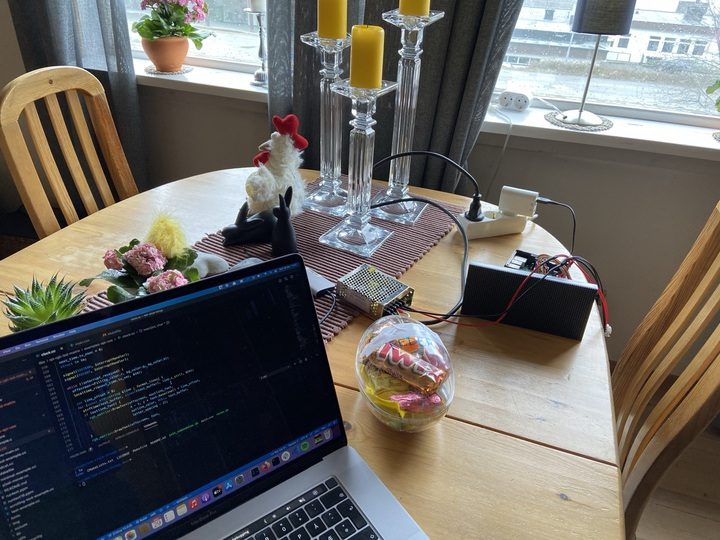
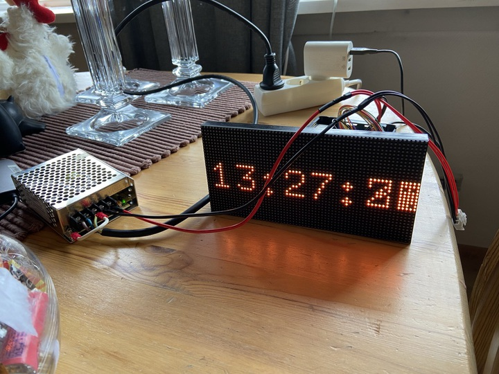
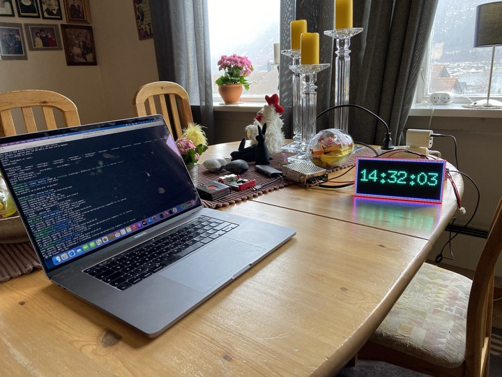

# Byggelogg

## Dag 1

Vi møttest hjå Dag. Erik brukte dagen på å jobbe med sitt digitale sjakkbrett. Dag venta på delar til sin eigen duppedings, og derfor blei han med på mitt prosjekt i dag. Det vi gjorde var:

- Eg satte opp Raspberry Pi med nyflasha operativsystem
- Dag kopla opp [LED-matrisa](https://www.adafruit.com/product/2279), heretter matrisa. Først kopla han opp vekselstraum inn til straumforsyninga, som eg hadde fått låne med Erik. Deretter kopla han opp 5V DC inn til matrisa. Til sist kopla han opp GPIO-pins på RPi til dataporten på matrisa. Det var rundt 14 kablar som skulle til.
- Eg leita etter software til å drive matrisa. Først prøvde vi ein npm-pakke som var ein wrapper rundt [dette biblioteket til C++](https://github.com/hzeller/rpi-rgb-led-matrix), men denne fekk vi ikkje til å fungere. Vi endte opp med å bruke biblioteket direkte i staden.
- Etter mykje prøving og feiling, både med npm-pakken og med C++-biblioteket, fann vi ut at vi hadde kopla feil. Vi fann eit anna koplingsdiagram som viste seg å vere det korrekte. Etter å ha kopla om til dette fekk vi C++-biblioteket til å fungere. 🎉
- C++-biblioteket hadde mange demos vi kunne køyre, og suksessen blei desto større sidan vi kunne vise masse feite greier på matrisa. 🍻

## Dag 2

Heile faggruppa møttest på kontoret. Eg tok diverre ingen bilder denne dagen, men det var nok sikkert like greit, for det var ikkje så mykje å ta bilde av. I hovudsak jobba eg med å sette opp koden + raspberryen slik at kunne styre skjermen frå eiga kode. Tidlegare hadde eg altså berre spelt av ting på skjermen ved å bruke ferdiglagde program i [rpi-rgb-led-matrix](https://github.com/hzeller/rpi-rgb-led-matrix), så det var ganske gøy å kunne teikne akkurat det eg sjølv ville.

## Dag 3

Første mandag i påskeferien blei eg fysen på litt LED-matrisefikling:

- Druste inn funksjonalitet for å vise klokkeslett på matrisa
- Knalla inn støtte for dobbelbufring, altså at eg teiknar det eg vil vise inn eit skjult buffer, som ein så byttar med det aktive grafikkbufferet. Dette hindrar rifter i det som blir teikna, som kan oppstå dersom ein muterer bufferet medan det held på å bli teikna til skjermen.
- Rydda litt opp i koden slik at den blei kjekkare å jobbe med

